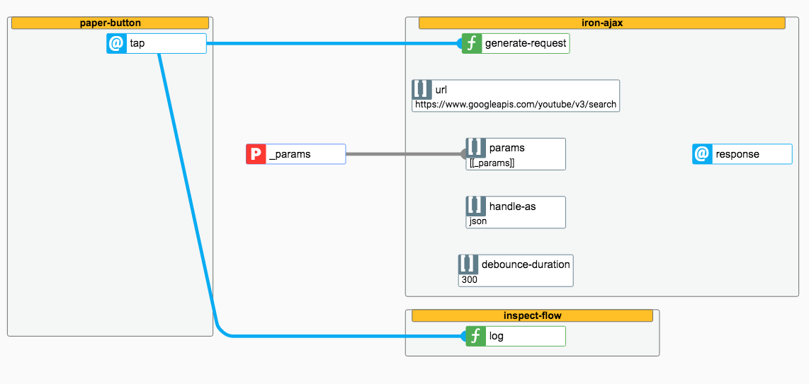

# \<flowbased-polymer\> for Polymer ^1.4.0

Write web-components with flowbased programming. You can use every polymer compatible component to build your component/app. **Without the need to write 1 line of code!** 


<h3>Demo and detailed Documentation</h3>

[DEMO and Documentation](https://veith.github.io/flowbased-polymer/components/flowbased-polymer/)


### Usage

Install the behaviour:
```
bower install flowbased-polymer --save
```

Don't forget the **import**
```
<link rel="import" href="../../bower_components/flowbased-polymer/behaviour.html">

```
Add the behaviour to your component
```
{
    behaviors: [Polymer.FlowBasedProgramming],
    properties:...
}

```

##The Concept 
All you have to do, is to wire the components in your component. 
  
###But How?  
Lets start with a few simple examples.

####fetch an event and trigger a function of another component
Bind the **tap** event from the paper-button to trigger the **generate-request** method from the iron-ajax using the wire --deleteClicked. 
```
 <paper-button @-tap="--deleteClicked"> delete </paper-button>
 <iron-ajax 
   ƒ-generate-request="--deleteClicked" 
   url="https://www.googleapis.com/youtube/v3/search"
   params='{"part":"snippet", "q":"polymer", "key": "YOUTUBE_API_KEY", "type": "video"}'
   handle-as="json"
   @-response="--searchResponded"
   debounce-duration="300"></iron-ajax> 
 <inspect-flow ƒ-log="--deleteClicked"></inspect-flow>
   
```
 With the "@-" keyword you can catch/bind/listen an event. The *wire* will transport the event.detail to the targets. With the "ƒ-" keyword you trigger the method of the receiving component.  
 Therfore the **inspect-flow** will log a "1" from the tap event, or a 2 if you doublecick.  
 
 

 A **wire** can have multiple sources and multiple targets. It is recommended, for better readability and understanding,  to label the wire with the action/intenton which happened.
 
 ####fetch an event and store the data to a property
 Bind the **response** event from iron-ajax to store the **event.detail** to the property searchResults 
 
 ```
  ...
  <iron-ajax 
    ƒ-generate-request="--deleteClicked" 
    url="https://www.googleapis.com/youtube/v3/search"
    params='{"part":"snippet", "q":"polymer", "key": "YOUTUBE_API_KEY", "type": "video"}'
    handle-as="json"
    @-response="((searchResults))"
    debounce-duration="300"></iron-ajax> 
    
    <iron-list items="[[searchResults]]" ...>
     <template>
      ...
    
 ```
####fire a non-bubbling event
Fire a non-bubbling event. The event is only available on the host. It can be used in the parent host (the host which is using the current component) 
```
  ...
  <iron-ajax 
    ƒ-generate-request="--deleteClicked" 
    url="https://www.googleapis.com/youtube/v3/search"
    params='{"part":"snippet", "q":"polymer", "key": "YOUTUBE_API_KEY", "type": "video"}'
    handle-as="json"
    @-response="^data-received"
    debounce-duration="300"></iron-ajax> 
    
    <iron-list items="[[searchResults]]" ...>
     <template>
      ...
    
 ```
 With "^event(propertyName)" you can send a data with the event
```
  ...
   <paper-button @-tap="^some-event(_privateProperty)"> check </paper-button> 
  ...
    
 ```
The event will send the content of _privateProperty as payload, it will not forward the data of the tap event.

####fire a bubbling event
To fire a bubbling-event use **^^event-name** or **^^other-event(propertyName)**. Bubbling events are working like non-bubbling events, but they will bubble. 

###triggering a function with multiple arguments
If the function you want to trigger requires more than one argument, all you have to do is delivering an array with the arguments as payload.
```
  ...
   <multiply-values ƒ-calculate="--wireWithArray" result="{{_result}}"></multiply-values>
   <paper-button @-tap="--wireWithArray(_values)"> calculate </paper-button> 
  ...
  ...
  ,properties:{
      _values:{
      type:Array,
      value:[3,2]
      }
  }
 ```
this will call the calculate function of multiply-values with the arguments 3 and 2.


<h3>Attention</h3>
Keep in mind that the "ƒ" symbol is not a regular "f". Press [alt] + f on mac.


###Why should I use FBP?
The following exapmples are doing the same, decide by yourself.

*with FBP*:
```
<emmiting-component @-response="((responseFromSomewhere))"></emmiting-component>
<emmiting-component @-response="otherResponse"></emmiting-component>

<receiving-component ƒ-show-data="otherResponse"></receiving-component>
{{responseFromSomewhere}}

```


*without FBP*:
```
<emmiting-component id="emmiter" on-response="handleResponseFromSomewhere"></emmiting-component>
<emmiting-component id="emmiterB" on-response="handleOtherResponseFromSomewhere"></emmiting-component>

<receiving-component id="receiver"></receiving-component>
{{responseFromSomewhere}}

Polymer({
    is: 'my-component',
    properties: {
        responseFromSomewhere:{
            type: String,

        }
    },
    handleResponseFromSomewhere:function(event){
        this.set(responseFromSomewhere, event.detail);
    },
    handleOtherResponseFromSomewhere:function(event){
        this.$.receiverB.showData(event.detail);
    }

});

```


